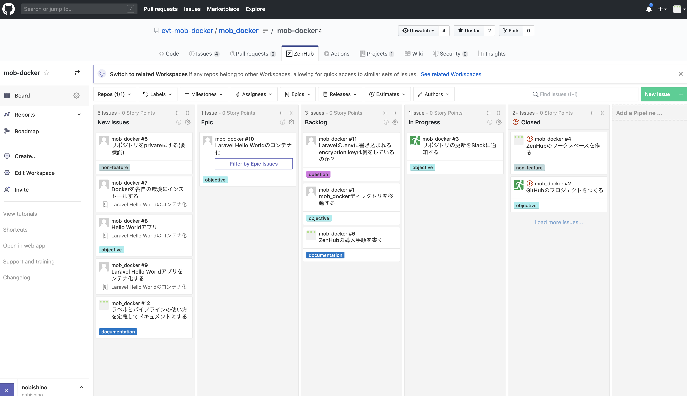

# Mob-Docker

* モブプログラミング・モブワーク形式でDockerを学習するプロジェクト
* 目指す雰囲気：「みんなで集まってRPGを攻略する」

- [Mob-Docker](#mob-docker)
  - [進め方](#%e9%80%b2%e3%82%81%e6%96%b9)
    - [issue管理方法](#issue%e7%ae%a1%e7%90%86%e6%96%b9%e6%b3%95)
      - [Label](#label)
      - [Pipeline](#pipeline)
      - [question issueの解決方法](#question-issue%e3%81%ae%e8%a7%a3%e6%b1%ba%e6%96%b9%e6%b3%95)
    - [Repositoryの更新のしかた](#repository%e3%81%ae%e6%9b%b4%e6%96%b0%e3%81%ae%e3%81%97%e3%81%8b%e3%81%9f)
  - [環境構築](#%e7%92%b0%e5%a2%83%e6%a7%8b%e7%af%89)
    - [install ZenHub Chrome extension](#install-zenhub-chrome-extension)
    - [install VSCode & LiveShare Extension](#install-vscode--liveshare-extension)
    - [実行方法](#%e5%ae%9f%e8%a1%8c%e6%96%b9%e6%b3%95)
    - [install composer (Optional)](#install-composer-optional)
      - [Mac](#mac)
      - [Linux](#linux)
    - [install mob_laravel](#install-moblaravel)
    - [mob_laravel 実行](#moblaravel-%e5%ae%9f%e8%a1%8c)
  - [やったこと](#%e3%82%84%e3%81%a3%e3%81%9f%e3%81%93%e3%81%a8)

## 進め方

* issue-centricに進める
* 質問や疑問点、オブジェクティブ（目標）、その他管理作業の全てをissueで表現する
* やって見たいこと、やると決めたこと、やっていること、やったことの全てを自動的に記録できるため

### issue管理方法

* issueは1つ以上の"Label"を持ち、1つの"Pipeline"に属する。
* Labelはissueの内容を表し、Pipelineはissueの状態を表す。

#### Label

* issueを作るときに1つ以上つける

| ラベル        | 内容                               |
| ------------- | ---------------------------------- |
| objective     | メインの作業目標                   |
| question      | 作業中に出てきた疑問点             |
| documentation | question以外のドキュメンテーション |
| non-feature   | その他管理作業                     |

#### Pipeline

* ZenHub上でカンバン形式で見られる。

| Pipelineの名前 | 内容                                                                                             |
| -------------- | ------------------------------------------------------------------------------------------------ |
| New Issues     | やってみたいこと。やることが確定するわけではない。よって、深く考えずに思いつきで雑に作って良い。 |
| Backlog        | やることは決まっているもの。とはいえ別に雑にここにissueを置いてしまって構わない。                |
| In Progress    | 着手しているもの                                                                                 |
| Closed         | 終了したもの、もしくはやらないことが決まったもの                                                 |



他に"Epic"というPipelineがあるが、これは上記4つとは毛色が異なり、複数のobjectiveを集めて大きなobjectiveとするために使う。

#### question issueの解決方法

* Learnings.mdに見出しを作って答えを書き込む
* PR(Pull Request)を作ってquestionを作った人にレビューリクエストする
* questionを作った人が納得したらapproveする
* approveしたら誰でもいいのでmergeしてissueをclosedにする

### Repositoryの更新のしかた

* モブワーク中とそれ以外の時で異なる。
* モブワーク中は直接masterにpushして良い
* モブワーク中以外に何か変更するときはブランチを切ってPull Requestを作り、レビューリクエストをする

## 環境構築

### install ZenHub Chrome extension

* [Chrome Extension](https://chrome.google.com/webstore/detail/zenhub-for-github/ogcgkffhplmphkaahpmffcafajaocjbd?hl=ja)を推奨する
* ZenHub自体にGitHubアカウントでログインすることでもworkspaceをみることができる

### install VSCode & LiveShare Extension

* [VS Code](https://code.visualstudio.com/)
* LiveShare Extension をインストールする

### 実行方法

プロジェクトルートに置いて、

```
docker-compose up -d
```

とすると、`localhost:8000`でアプリにアクセスできる。

アプリのソースコードは`php`以下にある。

### install composer (Optional)

#### Mac

```
brew install composer
```

#### Linux

* To be written

### install mob_laravel

```
composer install
cp .env.example .env
php artisan key:generate
```

### mob_laravel 実行

```
php artisan serve
```

## やったこと

* (誰か一人でOK) `laravel`コマンドをインストール
* `laravel new`
* `evt-mob-docker` Organization追加した
* `slack` との連携を追加
* `to be continued`